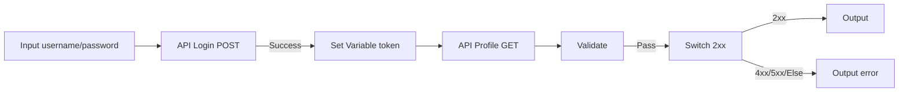
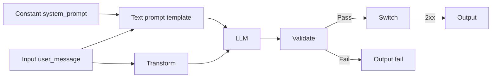

# VectorShift

React frontend + FastAPI backend. Run both for local development.

**Prerequisites:** Python 3.10+, Node.js (LTS)

---

## Backend

### Create and activate the virtual environment

1. Go to the backend directory:
   ```bash
   cd backend
   ```

2. Create a virtual environment locally:
   ```bash
   python3 -m venv venv
   ```
   On Windows, if `python3` is not found, use `python -m venv venv`.

3. Activate the virtual environment:
   - **On macOS/Linux:**
     ```bash
     source venv/bin/activate
     ```
   - **On Windows:**
     ```bash
     venv\Scripts\activate
     ```

### Install all the dependencies

After activating the virtual environment, install all the dependencies from the `requirements.txt` file:

```bash
python3 -m pip install -r requirements.txt
```

### To start the server

From the `backend` directory, run the FastAPI server:

```bash
uvicorn main:app --reload
```

- API: http://127.0.0.1:8000  
- Health check: http://127.0.0.1:8000 → `{"Ping":"Pong"}`  
- API docs: http://127.0.0.1:8000/docs  

---

## Frontend

### Install all the dependencies

From the project root:

```bash
cd frontend
npm install
```

### To start the app

```bash
npm start
```

- UI: http://localhost:3000  

Submit calls the backend at `http://127.0.0.1:8000` (see `frontend/.env`). **Keep both servers running.**

If Submit shows **404**, restart the frontend after changing `.env`: stop `npm start`, then run it again.

---

## Daily startup

**Terminal 1 — backend:**
```bash
cd backend
source venv/bin/activate          # macOS/Linux
# venv\Scripts\activate           # Windows
uvicorn main:app --reload
```

**Terminal 2 — frontend:**
```bash
cd frontend
npm start
```

Stop either server with `Ctrl + C`.

---

## Pipeline nodes

| Node | Role in a process |
|------|-------------------|
| **Input** | User-supplied values → `{{variable}}` |
| **Constant** | Fixed values (API keys, base URLs) → `{{variable}}` |
| **Text** | String templates with `{{variables}}` |
| **API** | HTTP call (Success / Fail outputs) |
| **Set Variable** | Extract JSON path from upstream → new `{{variable}}` |
| **Transform** | Reshape payload with a JSON template |
| **Validate** | Require fields before continuing (Pass / Fail) |
| **Switch** | Route by HTTP status (2xx / 4xx / 5xx / Else) |
| **Retry** | Retry policy for fragile steps |
| **Filter** / **Merge** | Row rules and combining streams |
| **LLM** | Model step |
| **Output** | Pipeline result |

Use **Submit** to validate the graph is a DAG (backend `/pipelines/parse`).

---

## Example workflows

### Workflow 1 — Authenticated API chain (login → protected call)

**Goal:** Log in, save a session token, call a protected endpoint, validate, then output.



**Build on canvas (left → right):**

1. **Input** — `username`, **Input** — `password` (or use **Constant** for test creds).
2. **API** — POST login URL; body `{"email":"{{username}}","password":"{{password}}"}`.
3. **Set Variable** — `varName`: `token`, `jsonPath`: `$.Session` (or your API’s token field).
4. **API** — GET profile URL; header `Authorization: Bearer {{token}}`.
5. **Validate** — `requiredFields`: `username,token`.
6. **Switch** — route on HTTP status from the profile call.
7. **Output** on Switch **2xx**; second **Output** on **4xx** / **5xx** for errors.

**Performance tip:** Put **Retry** before the profile **API** (max 3, 1000 ms) to absorb transient 5xx without redoing login.

---

### Workflow 2 — LLM pipeline with transform and validation

**Goal:** Normalize user input, build a prompt, call the LLM, validate JSON-shaped output.



**Build on canvas:**

1. **Constant** — `varName`: `system_prompt`, value: `You are a helpful assistant.`
2. **Input** — `user_message`.
3. **Text** — `System: {{system_prompt}}\n\nUser: {{user_message}}` (auto-wires variables).
4. **Transform** — template: `{"query":"{{user_message}}","source":"pipeline"}`.
5. **LLM** — connect **Text** → prompt, **Transform** → system (or swap per your model API).
6. **Validate** — `requiredFields`: `response,text` (adjust to your LLM output shape).
7. **Switch** + **Output** for success vs failure paths.

**Performance tip:** Keep **Transform** templates small; large JSON templates re-parse on every keystroke in the editor—collapse unused sections when editing.

